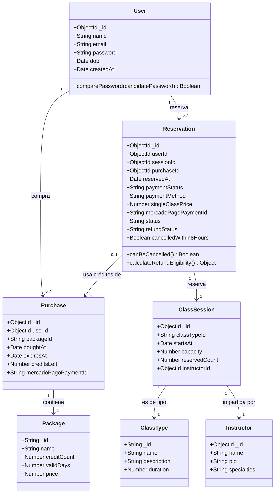
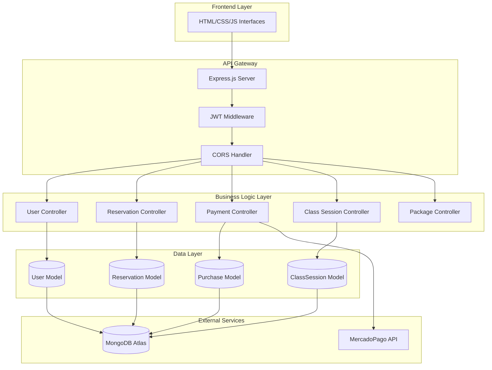
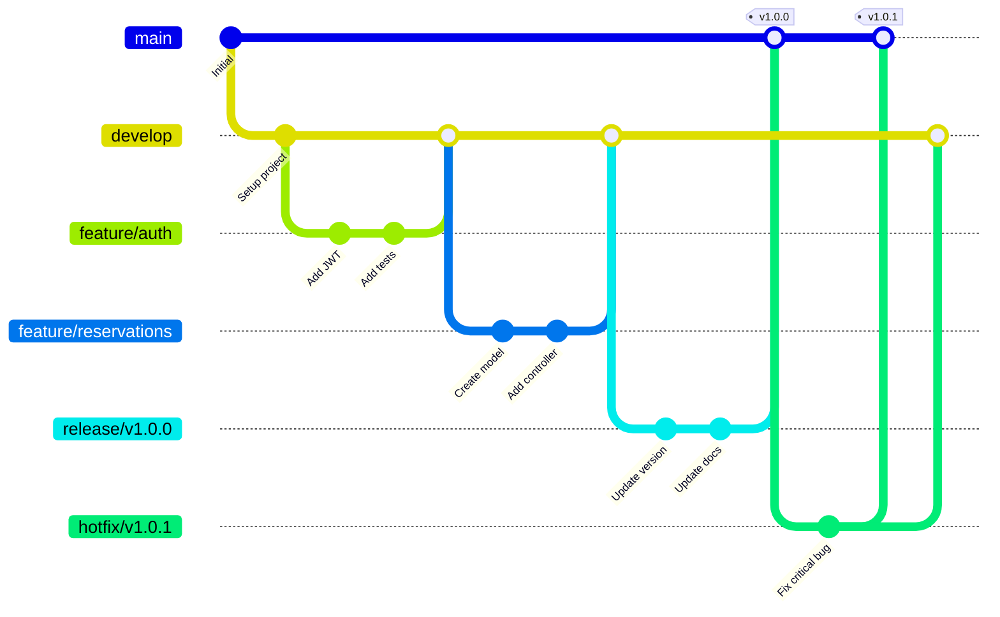

# Proyecto DevOps - Rebetta Studio (Pilates Studio)

## 📋 Tabla de Contenidos
1. [Título y Descripción del Proyecto](#título-y-descripción-del-proyecto)
2. [Componentes y Arquitectura](#componentes-y-arquitectura)
3. [Stack Tecnológico](#stack-tecnológico)
4. [Infraestructura en Azure](#infraestructura-en-azure)
5. [Diagrama de Deployment](#diagrama-de-deployment)
6. [Estrategia de Pruebas Unitarias](#estrategia-de-pruebas-unitarias)
7. [Azure Container Registry](#azure-container-registry)
8. [Estrategia de Ramas](#estrategia-de-ramas)
9. [Plan de Trabajo](#plan-de-trabajo)
10. [Azure DevOps Board](#azure-devops-board)

---

## 1. Título y Descripción del Proyecto

### Título
**Sistema de Gestión de Estudio de Pilates - Rebetta Studio**

### Descripción del Proyecto

Aplicación web full-stack para la gestión integral de un estudio de Pilates, que incluye:

**Funcionalidades Principales:**
- ✅ Sistema de autenticación y gestión de usuarios
- ✅ Gestión de clases y horarios
- ✅ Sistema de reservaciones con política de cancelación
- ✅ Venta de paquetes de clases con sistema de créditos
- ✅ Integración con MercadoPago para procesamiento de pagos
- ✅ Panel administrativo para gestión del estudio
- ✅ Sistema de reembolsos automáticos (política de 8 horas)

**Alcance del Proyecto:**
Sistema diseñado para facilitar la operación de estudios de fitness boutique, permitiendo a los clientes reservar clases, comprar paquetes y gestionar sus reservaciones, mientras que los administradores tienen control total sobre horarios, instructores y capacidad.

**Propuesta de Valor:**
- Automatización completa del proceso de reservación
- Gestión de pagos integrada con pasarela mexicana
- Sistema de créditos flexible con fechas de expiración
- Experiencia de usuario simplificada
- Reportes y métricas para toma de decisiones

---

## 2. Componentes y Arquitectura

### 2.1 Diagrama de Clases



### 2.2 Componentes del Sistema

#### **Backend Components**

**1. Authentication Module** (`middleware/auth.middleware.js`)
- Métodos principales:
  - `verifyToken(req, res, next)`: Verificación de JWT
  - `extractToken(authHeader)`: Extracción de token
  - `handleTokenError(err)`: Manejo de errores

**2. User Controller** (`controllers/user.controller.js`)
- Métodos:
  - `register(req, res)`: Registro de usuarios
  - `login(req, res)`: Autenticación
  - `getProfile(req, res)`: Obtener perfil
  - `updateProfile(req, res)`: Actualizar datos

**3. Reservation Controller** (`controllers/reservations.controller.js`)
- Métodos:
  - `createReservation(req, res)`: Crear reservación
  - `cancelReservation(req, res)`: Cancelar con lógica de reembolso
  - `getUserReservations(req, res)`: Listar reservaciones
  - `checkCapacity(sessionId)`: Verificar disponibilidad
  - `processRefund(reservationId)`: Procesar reembolsos

**4. Payment Controller** (`controllers/payment.controller.js`)
- Métodos:
  - `createPaymentPreference(req, res)`: Crear preferencia MP
  - `handleWebhook(req, res)`: Procesar notificaciones
  - `processRefund(paymentId, amount)`: Gestionar reembolsos
  - `verifyPaymentStatus(paymentId)`: Verificar estado

**5. Class Session Controller** (`controllers/classSessions.controller.js`)
- Métodos:
  - `getClassSessions(req, res)`: Listar clases
  - `createClassSession(req, res)`: Crear clase
  - `updateClassSession(req, res)`: Actualizar clase
  - `deleteClassSession(req, res)`: Eliminar clase
  - `getAvailableSessions(req, res)`: Clases disponibles

**6. Package Controller** (`controllers/packages.controller.js`)
- Métodos:
  - `getPackages(req, res)`: Listar paquetes
  - `purchasePackage(req, res)`: Comprar paquete
  - `validatePurchase(userId, packageId)`: Validar compra

**7. Purchase Controller** (`controllers/purchases.controller.js`)
- Métodos:
  - `getUserPurchases(req, res)`: Historial de compras
  - `getActivePurchase(userId)`: Obtener paquete activo
  - `deductCredit(purchaseId)`: Descontar crédito
  - `checkExpiration(purchaseId)`: Verificar vigencia

#### **Frontend Components**

**1. API Service** (`interfaces/api-service.js`)
- Métodos:
  - `apiCall(endpoint, method, data)`: Cliente HTTP centralizado
  - `handleAuthToken()`: Gestión de tokens
  - `handleErrors(response)`: Manejo de errores

**2. Reservation Handler** (`interfaces/reservation-handler.js`)
- Métodos:
  - `bookClass(sessionId, paymentMethod)`: Reservar clase
  - `cancelReservation(reservationId)`: Cancelar reserva
  - `validateBooking(session)`: Validar disponibilidad

**3. Dashboard Manager** (`interfaces/dashboard.js`)
- Métodos:
  - `loadUserData()`: Cargar datos del usuario
  - `displayUpcomingClasses()`: Mostrar próximas clases
  - `displayActivePackage()`: Mostrar paquete activo

**4. Data Display** (`interfaces/data-display.js`)
- Métodos:
  - `renderClassCards(classes)`: Renderizar clases
  - `renderReservations(reservations)`: Mostrar reservas
  - `updateCreditsDisplay(credits)`: Actualizar créditos

### 2.3 Arquitectura de Integración



---

## 3. Stack Tecnológico

### 3.1 Backend Stack

| Tecnología | Versión | Propósito |
|------------|---------|-----------|
| **Node.js** | 18.x LTS | Runtime de JavaScript |
| **Express.js** | 5.1.0 | Framework web |
| **MongoDB** | 6.0+ | Base de datos NoSQL |
| **Mongoose** | 8.16.2 | ODM para MongoDB |
| **JWT** | 9.0.2 | Autenticación basada en tokens |
| **bcryptjs** | 3.0.2 | Hash de contraseñas |
| **Helmet** | 8.1.0 | Seguridad HTTP headers |
| **CORS** | 2.8.5 | Cross-Origin Resource Sharing |
| **MercadoPago SDK** | 2.8.0 | Procesamiento de pagos |
| **dotenv** | 17.1.0 | Variables de entorno |
| **express-rate-limit** | 7.5.1 | Rate limiting |

### 3.2 Frontend Stack

| Tecnología | Versión | Propósito |
|------------|---------|-----------|
| **HTML5** | - | Estructura |
| **CSS3** | - | Estilos |
| **JavaScript (Vanilla)** | ES6+ | Lógica del cliente |
| **Fetch API** | - | Comunicación HTTP |

### 3.3 DevOps & Infrastructure Stack

| Tecnología | Propósito |
|------------|-----------|
| **Docker** | Containerización |
| **Docker Compose** | Orquestación local |
| **Azure DevOps** | CI/CD Pipelines |
| **Azure Container Registry (ACR)** | Registro de imágenes |
| **Azure App Service** | Hosting de aplicación |
| **Azure Database for MongoDB** | Base de datos managed |
| **Azure Key Vault** | Gestión de secretos |
| **Azure Monitor** | Monitoreo y logs |
| **Git** | Control de versiones |

### 3.4 Testing Stack

| Tecnología | Propósito |
|------------|-----------|
| **Jest** | Framework de testing |
| **Supertest** | Testing de APIs HTTP |
| **MongoDB Memory Server** | BD en memoria para tests |
| **ESLint** | Linting de código |
| **Prettier** | Formateo de código |

### 3.5 Herramientas de Desarrollo

- **Visual Studio Code** - IDE principal
- **Postman** - Testing de APIs
- **MongoDB Compass** - Cliente de MongoDB
- **Azure CLI** - Gestión de recursos Azure
- **ngrok** - Túnel HTTPS para desarrollo local

---

## 4. Infraestructura en Azure

### 4.1 Diagrama de Infraestructura

```mermaid
graph TB
    subgraph "Azure Cloud"
        subgraph "Resource Group: rg-pilates-prod"
            subgraph "Networking"
                AppGW[Application Gateway<br/>SSL Termination]
                DNS[Azure DNS<br/>rebetta-studio.fit]
            end

            subgraph "Compute"
                AppService[Azure App Service<br/>Plan: P1v2<br/>Node.js 18 LTS]
            end

            subgraph "Container Registry"
                ACR[Azure Container Registry<br/>acrpilatesstudio]
            end

            subgraph "Data Layer"
                MongoDB[(Azure Cosmos DB<br/>MongoDB API<br/>o MongoDB Atlas)]
            end

            subgraph "Security"
                KeyVault[Azure Key Vault<br/>Secretos y certificados]
            end

            subgraph "Monitoring"
                AppInsights[Application Insights<br/>Telemetría y logs]
                LogAnalytics[Log Analytics<br/>Workspace]
            end

            subgraph "Storage"
                Storage[Azure Blob Storage<br/>Backups y assets]
            end
        end

        subgraph "Azure DevOps"
            Repos[Azure Repos]
            Pipelines[Azure Pipelines]
            Boards[Azure Boards]
        end
    end

    subgraph "External Services"
        MP[MercadoPago API]
        Users[Usuarios Finales]
    end

    Users -->|HTTPS| DNS
    DNS --> AppGW
    AppGW --> AppService

    Repos --> Pipelines
    Pipelines -->|Build & Push| ACR
    ACR -->|Pull Image| AppService

    AppService --> MongoDB
    AppService --> KeyVault
    AppService --> AppInsights
    AppService --> Storage
    AppService -->|Pagos| MP

    AppInsights --> LogAnalytics
```

### 4.2 Recursos de Azure a Crear

#### **Grupo de Recursos**
```
Nombre: rg-pilates-studio-prod
Región: East US 2
Tags:
  - Environment: Production
  - Project: Rebetta-Studio
  - CostCenter: Operations
```

#### **1. Azure App Service**
- **Nombre**: app-pilates-studio-prod
- **Plan**: P1v2 (1 Core, 3.5 GB RAM)
- **Sistema Operativo**: Linux
- **Runtime Stack**: Node.js 18 LTS
- **Configuración**:
  - Always On: Enabled
  - HTTPS Only: Enabled
  - HTTP Version: 2.0
  - Minimum TLS Version: 1.2
  - ARR Affinity: Disabled
  - Auto-scaling: Enabled (2-5 instancias)

#### **2. Azure Container Registry**
- **Nombre**: acrpilatesstudio
- **SKU**: Standard
- **Admin Access**: Enabled
- **Replicación**: Single region
- **Retention Policy**: 30 días para imágenes no etiquetadas

#### **3. Azure Cosmos DB (MongoDB API)** o **MongoDB Atlas**
- **Opción A - Cosmos DB**:
  - API: MongoDB
  - Capacity Mode: Provisioned throughput
  - RU/s: 400 (autoscale hasta 4000)
  - Backup: Continuous (PITR 30 días)

- **Opción B - MongoDB Atlas** (Recomendado):
  - Tier: M10 (Dedicated)
  - Region: Azure East US 2
  - Backup: Continuous Cloud Backup

#### **4. Azure Key Vault**
- **Nombre**: kv-pilates-studio
- **Pricing Tier**: Standard
- **Secretos a Almacenar**:
  - JWT_SECRET
  - MONGODB_URI
  - MP_ACCESS_TOKEN
  - MP_PUBLIC_KEY
  - SESSION_SECRET

#### **5. Azure Application Insights**
- **Nombre**: appi-pilates-studio
- **Sampling**: Adaptive
- **Retention**: 90 días
- **Alertas Configuradas**:
  - Response time > 3s
  - Error rate > 5%
  - Availability < 99%

#### **6. Azure Blob Storage**
- **Nombre**: stpilatesstudio
- **Replication**: LRS (Locally Redundant)
- **Containers**:
  - backups (Private)
  - assets (Public - imágenes, CSS, JS)
  - logs (Private)

#### **7. Azure Application Gateway (Opcional)**
- **SKU**: Standard_v2
- **Funciones**:
  - SSL Termination
  - WAF (Web Application Firewall)
  - URL Routing
  - Session Affinity

### 4.3 Estimación de Costos Mensuales (USD)

| Recurso | SKU/Plan | Costo Estimado |
|---------|----------|----------------|
| App Service Plan P1v2 | 1 instancia | $73.00 |
| Container Registry Standard | 100GB almacenamiento | $20.00 |
| MongoDB Atlas M10 | Shared | $57.00 |
| Key Vault | Operaciones estándar | $5.00 |
| Application Insights | 5GB datos/mes | $15.00 |
| Blob Storage | 50GB LRS | $1.00 |
| Azure DevOps | Basic (5 usuarios) | Gratis |
| **Total Estimado** | | **~$171/mes** |

---

## 5. Diagrama de Deployment

### 5.1 Pipeline de CI/CD

```mermaid
graph LR
    subgraph "Development"
        Dev[Desarrollador]
        LocalGit[Git Local]
    end

    subgraph "Azure DevOps"
        AzureRepos[Azure Repos]

        subgraph "CI Pipeline"
            Trigger[Trigger on Push]
            Checkout[Checkout Code]
            Install[npm install]
            Lint[ESLint]
            Test[Jest Tests]
            Build[Docker Build]
            Push[Push to ACR]
            Tag[Tag Image]
        end

        subgraph "CD Pipeline"
            Approve[Manual Approval]
            Pull[Pull from ACR]
            Deploy[Deploy to App Service]
            HealthCheck[Health Check]
            Rollback[Rollback if Failed]
        end
    end

    subgraph "Azure Production"
        ACR[Azure Container Registry]
        AppService[App Service]
        MongoDB[(MongoDB)]
    end

    Dev --> LocalGit
    LocalGit --> AzureRepos
    AzureRepos --> Trigger
    Trigger --> Checkout
    Checkout --> Install
    Install --> Lint
    Lint --> Test
    Test --> Build
    Build --> Push
    Push --> ACR
    Push --> Tag

    Tag --> Approve
    Approve --> Pull
    Pull --> ACR
    ACR --> Deploy
    Deploy --> AppService
    AppService --> HealthCheck
    HealthCheck -->|Failed| Rollback
    HealthCheck -->|Success| MongoDB
```



### 5.2 Estrategia de Deployment

#### **Ambientes**

| Ambiente | Branch | Trigger | Approval |
|----------|--------|---------|----------|
| **Development** | `develop` | Automático | No |
| **Staging** | `release/*` | Automático | No |
| **Production** | `main` | Manual | Sí (2 aprobadores) |

#### **Deployment Slots (App Service)**

1. **Production Slot** - Tráfico 100%
2. **Staging Slot** - Testing pre-producción
3. **Blue-Green Deployment** - Swap entre slots

#### **Rollback Strategy**

1. **Automático**: Si health check falla después del deployment
2. **Manual**: Botón de rollback en Azure DevOps
3. **Versiones**: Mantener últimas 5 imágenes en ACR
4. **Base de datos**: Backups continuos (PITR)

### 5.3 Proceso de Deployment Detallado

**Fase 1: Build (CI)**
1. Desarrollador hace push a rama
2. Azure Pipelines detecta cambio
3. Ejecuta tests unitarios
4. Ejecuta linting
5. Construye imagen Docker
6. Escanea vulnerabilidades (Trivy)
7. Publica imagen a ACR con tag único
8. Genera artifact con manifiestos

**Fase 2: Deployment (CD - Staging)**
1. Pull de imagen desde ACR
2. Deploy a slot de staging
3. Ejecuta smoke tests
4. Ejecuta integration tests
5. Notifica en Teams/Slack

**Fase 3: Deployment (CD - Production)**
1. Requiere aprobación manual
2. Pull de imagen desde ACR
3. Deploy a slot production
4. Blue-Green swap
5. Health check (5 minutos)
6. Si falla: rollback automático
7. Si éxito: retiene slot anterior 24h

---

## 6. Estrategia de Pruebas Unitarias

### 6.1 Framework y Herramientas

```json
{
  "devDependencies": {
    "jest": "^29.7.0",
    "supertest": "^6.3.3",
    "@types/jest": "^29.5.5",
    "mongodb-memory-server": "^9.1.1",
    "eslint": "^8.52.0",
    "eslint-config-airbnb-base": "^15.0.0",
    "prettier": "^3.0.3"
  }
}
```

### 6.2 Estructura de Tests

```
tests/
├── unit/                          # Tests unitarios
│   ├── models/
│   │   ├── user.model.test.js
│   │   ├── reservation.model.test.js
│   │   └── purchase.model.test.js
│   ├── controllers/
│   │   ├── user.controller.test.js
│   │   ├── reservation.controller.test.js
│   │   └── payment.controller.test.js
│   ├── middleware/
│   │   └── auth.middleware.test.js
│   └── helpers/
│       └── jwt.helper.test.js
├── integration/                   # Tests de integración
│   ├── api/
│   │   ├── auth.api.test.js
│   │   ├── reservations.api.test.js
│   │   └── payments.api.test.js
│   └── database/
│       └── mongo.integration.test.js
└── e2e/                          # Tests end-to-end
    └── booking-flow.e2e.test.js
```

### 6.3 Ejemplos de Tests

#### Ejemplo 1: Test de Modelo (User)

```javascript
// tests/unit/models/user.model.test.js
const mongoose = require('mongoose');
const { MongoMemoryServer } = require('mongodb-memory-server');
const User = require('../../../schemas/user.model');

let mongoServer;

describe('User Model Tests', () => {
  beforeAll(async () => {
    mongoServer = await MongoMemoryServer.create();
    await mongoose.connect(mongoServer.getUri());
  });

  afterAll(async () => {
    await mongoose.disconnect();
    await mongoServer.stop();
  });

  afterEach(async () => {
    await User.deleteMany({});
  });

  describe('User Creation', () => {
    it('should create a user successfully with valid data', async () => {
      const userData = {
        name: 'Test User',
        email: 'test@example.com',
        password: 'Password123!',
        dob: new Date('1990-01-01')
      };

      const user = await User.create(userData);

      expect(user._id).toBeDefined();
      expect(user.name).toBe(userData.name);
      expect(user.email).toBe(userData.email);
      expect(user.password).not.toBe(userData.password); // Should be hashed
    });

    it('should fail to create user without required fields', async () => {
      const invalidUser = new User({ name: 'Test' });
      let error;

      try {
        await invalidUser.save();
      } catch (err) {
        error = err;
      }

      expect(error).toBeDefined();
      expect(error.errors.email).toBeDefined();
      expect(error.errors.password).toBeDefined();
    });

    it('should fail to create user with invalid email format', async () => {
      const userData = {
        name: 'Test User',
        email: 'invalid-email',
        password: 'Password123!',
        dob: new Date('1990-01-01')
      };

      let error;
      try {
        await User.create(userData);
      } catch (err) {
        error = err;
      }

      expect(error).toBeDefined();
      expect(error.errors.email).toBeDefined();
    });
  });

  describe('Password Hashing', () => {
    it('should hash password before saving', async () => {
      const plainPassword = 'MySecurePassword123!';
      const user = await User.create({
        name: 'Hash Test',
        email: 'hash@test.com',
        password: plainPassword,
        dob: new Date('1990-01-01')
      });

      expect(user.password).not.toBe(plainPassword);
      expect(user.password).toMatch(/^\$2[ayb]\$.{56}$/); // bcrypt format
    });

    it('should compare passwords correctly', async () => {
      const plainPassword = 'TestPassword123!';
      const user = await User.create({
        name: 'Compare Test',
        email: 'compare@test.com',
        password: plainPassword,
        dob: new Date('1990-01-01')
      });

      const isMatch = await user.comparePassword(plainPassword);
      const isNotMatch = await user.comparePassword('WrongPassword');

      expect(isMatch).toBe(true);
      expect(isNotMatch).toBe(false);
    });
  });
});
```

#### Ejemplo 2: Test de Controller (Reservations)

```javascript
// tests/unit/controllers/reservation.controller.test.js
const reservationController = require('../../../controllers/reservations.controller');
const Reservation = require('../../../schemas/reservations.model');
const ClassSession = require('../../../schemas/classSessions.model');
const Purchase = require('../../../schemas/purchases.model');

jest.mock('../../../schemas/reservations.model');
jest.mock('../../../schemas/classSessions.model');
jest.mock('../../../schemas/purchases.model');

describe('Reservation Controller Tests', () => {
  let req, res;

  beforeEach(() => {
    req = {
      body: {},
      params: {},
      user: { id: 'user123', email: 'test@example.com' }
    };
    res = {
      status: jest.fn().mockReturnThis(),
      json: jest.fn()
    };
  });

  afterEach(() => {
    jest.clearAllMocks();
  });

  describe('createReservation', () => {
    it('should create reservation successfully with package credits', async () => {
      const mockSession = {
        _id: 'session123',
        capacity: 5,
        reservedCount: 2,
        startsAt: new Date(Date.now() + 24 * 60 * 60 * 1000) // 24h adelante
      };

      const mockPurchase = {
        _id: 'purchase123',
        creditsLeft: 5,
        expiresAt: new Date(Date.now() + 30 * 24 * 60 * 60 * 1000)
      };

      req.body = {
        sessionId: 'session123',
        paymentMethod: 'package'
      };

      ClassSession.findById = jest.fn().mockResolvedValue(mockSession);
      Purchase.findOne = jest.fn().mockResolvedValue(mockPurchase);
      Reservation.countDocuments = jest.fn().mockResolvedValue(0);
      Reservation.prototype.save = jest.fn().mockResolvedValue({
        _id: 'reservation123',
        userId: req.user.id,
        sessionId: mockSession._id,
        paymentMethod: 'package'
      });

      await reservationController.createReservation(req, res);

      expect(res.status).toHaveBeenCalledWith(201);
      expect(res.json).toHaveBeenCalledWith(
        expect.objectContaining({
          success: true,
          message: expect.any(String)
        })
      );
    });

    it('should fail when class is at full capacity', async () => {
      const mockSession = {
        _id: 'session123',
        capacity: 5,
        reservedCount: 5, // Full!
        startsAt: new Date(Date.now() + 24 * 60 * 60 * 1000)
      };

      req.body = { sessionId: 'session123' };
      ClassSession.findById = jest.fn().mockResolvedValue(mockSession);

      await reservationController.createReservation(req, res);

      expect(res.status).toHaveBeenCalledWith(400);
      expect(res.json).toHaveBeenCalledWith(
        expect.objectContaining({
          success: false,
          message: expect.stringContaining('capacidad')
        })
      );
    });

    it('should fail when booking within 8 hours of class start', async () => {
      const mockSession = {
        _id: 'session123',
        capacity: 5,
        reservedCount: 2,
        startsAt: new Date(Date.now() + 4 * 60 * 60 * 1000) // 4h adelante
      };

      req.body = { sessionId: 'session123' };
      ClassSession.findById = jest.fn().mockResolvedValue(mockSession);

      await reservationController.createReservation(req, res);

      expect(res.status).toHaveBeenCalledWith(400);
      expect(res.json).toHaveBeenCalledWith(
        expect.objectContaining({
          success: false,
          message: expect.stringContaining('8 horas')
        })
      );
    });
  });

  describe('cancelReservation', () => {
    it('should cancel reservation and process refund when eligible', async () => {
      const mockReservation = {
        _id: 'reservation123',
        userId: 'user123',
        status: 'confirmed',
        paymentMethod: 'single_class',
        mercadoPagoPaymentId: 'mp123',
        sessionId: {
          startsAt: new Date(Date.now() + 24 * 60 * 60 * 1000) // 24h adelante
        },
        calculateRefundEligibility: jest.fn().mockReturnValue({
          eligible: true,
          hoursUntilClass: 24
        }),
        save: jest.fn().mockResolvedValue(true)
      };

      req.params = { id: 'reservation123' };
      Reservation.findById = jest.fn().mockResolvedValue(mockReservation);

      await reservationController.cancelReservation(req, res);

      expect(mockReservation.status).toBe('cancelled');
      expect(res.status).toHaveBeenCalledWith(200);
      expect(res.json).toHaveBeenCalledWith(
        expect.objectContaining({
          success: true,
          refundProcessed: true
        })
      );
    });
  });
});
```

#### Ejemplo 3: Test de Middleware (Auth)

```javascript
// tests/unit/middleware/auth.middleware.test.js
const jwt = require('jsonwebtoken');
const { verifyToken } = require('../../../middleware/auth.middleware');

jest.mock('jsonwebtoken');

describe('Auth Middleware Tests', () => {
  let req, res, next;

  beforeEach(() => {
    req = {
      headers: {}
    };
    res = {
      status: jest.fn().mockReturnThis(),
      json: jest.fn()
    };
    next = jest.fn();
    process.env.JWT_SECRET = 'test-secret-key';
  });

  afterEach(() => {
    jest.clearAllMocks();
  });

  it('should pass with valid token', () => {
    const mockDecoded = {
      id: 'user123',
      email: 'test@example.com'
    };

    req.headers.authorization = 'Bearer valid-token';
    jwt.verify.mockImplementation((token, secret, callback) => {
      callback(null, mockDecoded);
    });

    verifyToken(req, res, next);

    expect(req.user).toEqual({
      id: mockDecoded.id,
      email: mockDecoded.email,
      role: 'user'
    });
    expect(next).toHaveBeenCalled();
  });

  it('should fail without authorization header', () => {
    verifyToken(req, res, next);

    expect(res.status).toHaveBeenCalledWith(401);
    expect(res.json).toHaveBeenCalledWith({
      success: false,
      message: 'Authorization header is required'
    });
    expect(next).not.toHaveBeenCalled();
  });

  it('should fail with expired token', () => {
    req.headers.authorization = 'Bearer expired-token';
    jwt.verify.mockImplementation((token, secret, callback) => {
      const error = new Error('jwt expired');
      error.name = 'TokenExpiredError';
      callback(error);
    });

    verifyToken(req, res, next);

    expect(res.status).toHaveBeenCalledWith(403);
    expect(res.json).toHaveBeenCalledWith({
      success: false,
      message: 'Token has expired'
    });
    expect(next).not.toHaveBeenCalled();
  });
});
```

#### Ejemplo 4: Test de API (Integration)

```javascript
// tests/integration/api/auth.api.test.js
const request = require('supertest');
const mongoose = require('mongoose');
const { MongoMemoryServer } = require('mongodb-memory-server');
const app = require('../../../server');
const User = require('../../../schemas/user.model');

let mongoServer;

describe('Auth API Integration Tests', () => {
  beforeAll(async () => {
    mongoServer = await MongoMemoryServer.create();
    await mongoose.connect(mongoServer.getUri());
  });

  afterAll(async () => {
    await mongoose.disconnect();
    await mongoServer.stop();
  });

  afterEach(async () => {
    await User.deleteMany({});
  });

  describe('POST /api/users/register', () => {
    it('should register a new user successfully', async () => {
      const userData = {
        name: 'Integration Test',
        email: 'integration@test.com',
        password: 'SecurePass123!',
        dob: '1990-01-01'
      };

      const response = await request(app)
        .post('/api/users/register')
        .send(userData)
        .expect(201);

      expect(response.body.success).toBe(true);
      expect(response.body.user).toHaveProperty('email', userData.email);
      expect(response.body).toHaveProperty('token');
    });

    it('should fail with duplicate email', async () => {
      const userData = {
        name: 'Test User',
        email: 'duplicate@test.com',
        password: 'Password123!',
        dob: '1990-01-01'
      };

      await User.create(userData);

      const response = await request(app)
        .post('/api/users/register')
        .send(userData)
        .expect(400);

      expect(response.body.success).toBe(false);
      expect(response.body.message).toContain('existe');
    });
  });

  describe('POST /api/users/login', () => {
    it('should login with valid credentials', async () => {
      const userData = {
        name: 'Login Test',
        email: 'login@test.com',
        password: 'Password123!',
        dob: new Date('1990-01-01')
      };

      await User.create(userData);

      const response = await request(app)
        .post('/api/users/login')
        .send({
          email: userData.email,
          password: userData.password
        })
        .expect(200);

      expect(response.body.success).toBe(true);
      expect(response.body).toHaveProperty('token');
      expect(response.body.user.email).toBe(userData.email);
    });

    it('should fail with incorrect password', async () => {
      const userData = {
        name: 'Login Test',
        email: 'login@test.com',
        password: 'CorrectPassword123!',
        dob: new Date('1990-01-01')
      };

      await User.create(userData);

      const response = await request(app)
        .post('/api/users/login')
        .send({
          email: userData.email,
          password: 'WrongPassword123!'
        })
        .expect(401);

      expect(response.body.success).toBe(false);
    });
  });
});
```

### 6.4 Configuración de Jest

```javascript
// jest.config.js
module.exports = {
  testEnvironment: 'node',
  coverageDirectory: 'coverage',
  collectCoverageFrom: [
    'controllers/**/*.js',
    'middleware/**/*.js',
    'helpers/**/*.js',
    'schemas/**/*.js',
    '!node_modules/**'
  ],
  coverageThreshold: {
    global: {
      branches: 70,
      functions: 75,
      lines: 80,
      statements: 80
    }
  },
  testMatch: [
    '**/tests/**/*.test.js'
  ],
  setupFilesAfterEnv: ['<rootDir>/tests/setup.js'],
  testTimeout: 10000
};
```

### 6.5 Métricas de Calidad Objetivo

| Métrica | Objetivo |
|---------|----------|
| **Code Coverage** | ≥ 80% |
| **Branch Coverage** | ≥ 70% |
| **Test Pass Rate** | 100% |
| **Test Execution Time** | < 2 minutos |
| **Critical Paths Coverage** | 100% |

### 6.6 Test Pyramid

```
       /\
      /E2E\        10% - End-to-End (Usuario completo)
     /______\
    /        \
   /Integration\ 30% - API + DB Integration
  /____________\
 /              \
/  Unit Tests    \ 60% - Lógica de negocio aislada
/__________________\
```

---

## 7. Azure Container Registry

### 7.1 Configuración de ACR

**Nombre del Registry**: `acrpilatesstudio.azurecr.io`

**Autenticación**:
```bash
# Login desde Azure CLI
az acr login --name acrpilatesstudio

# Obtener credenciales para Docker
az acr credential show --name acrpilatesstudio
```

### 7.2 Estructura de Tags

**Convención de Nomenclatura**:
```
<registry>/<repository>:<tag>

Ejemplos:
- acrpilatesstudio.azurecr.io/pilates-app:latest
- acrpilatesstudio.azurecr.io/pilates-app:v1.2.3
- acrpilatesstudio.azurecr.io/pilates-app:develop-abc123
- acrpilatesstudio.azurecr.io/pilates-app:prod-20250112-v1.2.3
```

**Estrategia de Tags**:

| Ambiente | Tag Pattern | Ejemplo | Descripción |
|----------|------------|---------|-------------|
| **Development** | `develop-<short-sha>` | `develop-a3f2c1e` | Builds de develop |
| **Staging** | `staging-<version>` | `staging-v1.2.3-rc1` | Release candidates |
| **Production** | `v<major>.<minor>.<patch>` | `v1.2.3` | Semantic versioning |
| **Latest** | `latest` | `latest` | Último build estable |
| **Backup** | `backup-<timestamp>` | `backup-20250112` | Backup antes de deploy |

### 7.3 Dockerfile Multi-Stage Optimizado

```dockerfile
# Stage 1: Dependencies
FROM node:18-alpine AS dependencies
WORKDIR /app
COPY package*.json ./
RUN npm ci --only=production && npm cache clean --force

# Stage 2: Build (si hubiera proceso de build)
FROM node:18-alpine AS builder
WORKDIR /app
COPY package*.json ./
RUN npm ci
COPY . .
# RUN npm run build (si aplicara)

# Stage 3: Production
FROM node:18-alpine AS production

# Metadatos
LABEL maintainer="devops@rebetta-studio.fit"
LABEL version="1.0.0"
LABEL description="Pilates Studio Management System"

# Security: Run as non-root user
RUN addgroup -g 1001 -S nodejs && \
    adduser -S nodejs -u 1001

WORKDIR /app

# Copy dependencies
COPY --from=dependencies --chown=nodejs:nodejs /app/node_modules ./node_modules

# Copy application code
COPY --chown=nodejs:nodejs . .

# Environment
ENV NODE_ENV=production
ENV PORT=5000
ENV TZ=America/Mexico_City

USER nodejs

EXPOSE 5000

HEALTHCHECK --interval=30s --timeout=10s --start-period=40s --retries=3 \
  CMD node -e "require('http').get('http://localhost:5000/api/ping', (res) => { process.exit(res.statusCode === 200 ? 0 : 1); })"

CMD ["node", "server.js"]
```

### 7.4 .dockerignore

```
node_modules
npm-debug.log
.env
.env.local
.git
.gitignore
README.md
.vscode
.idea
coverage
.DS_Store
*.md
tests
.github
azure-pipelines.yml
docker-compose*.yml
Dockerfile
.dockerignore
interfaces/images/*.psd
*.log
```

### 7.5 Scripts de Build y Push

**build-and-push.sh**:
```bash
#!/bin/bash
set -e

# Variables
REGISTRY="acrpilatesstudio.azurecr.io"
IMAGE_NAME="pilates-app"
VERSION=$1
SHORT_SHA=$(git rev-parse --short HEAD)
BUILD_DATE=$(date -u +"%Y-%m-%dT%H:%M:%SZ")

# Validación
if [ -z "$VERSION" ]; then
    echo "Error: Debes proporcionar una versión"
    echo "Uso: ./build-and-push.sh v1.2.3"
    exit 1
fi

# Login a ACR
echo "🔐 Autenticando en Azure Container Registry..."
az acr login --name acrpilatesstudio

# Build
echo "🔨 Construyendo imagen Docker..."
docker build \
  --build-arg BUILD_DATE="$BUILD_DATE" \
  --build-arg VERSION="$VERSION" \
  --build-arg VCS_REF="$SHORT_SHA" \
  -t "$REGISTRY/$IMAGE_NAME:$VERSION" \
  -t "$REGISTRY/$IMAGE_NAME:latest" \
  .

# Escaneo de seguridad (opcional)
echo "🔍 Escaneando vulnerabilidades..."
docker scan "$REGISTRY/$IMAGE_NAME:$VERSION" || true

# Push
echo "📤 Subiendo imagen a ACR..."
docker push "$REGISTRY/$IMAGE_NAME:$VERSION"
docker push "$REGISTRY/$IMAGE_NAME:latest"

echo "✅ Imagen publicada exitosamente:"
echo "   - $REGISTRY/$IMAGE_NAME:$VERSION"
echo "   - $REGISTRY/$IMAGE_NAME:latest"
```

### 7.6 Políticas de Retención

**Configuración en Azure Portal**:
```yaml
# ACR Task para limpieza automática
retention_policy:
  days: 30
  keep_minimum: 5
  status: enabled

purge_rules:
  - name: delete-untagged
    description: Eliminar imágenes sin tag después de 7 días
    filter: ".*"
    action: delete
    age_days: 7

  - name: keep-production-tags
    description: Mantener tags de producción indefinidamente
    filter: "^v[0-9]+\\.[0-9]+\\.[0-9]+$"
    action: keep

  - name: delete-old-develop
    description: Eliminar builds de develop > 14 días
    filter: "^develop-.*"
    action: delete
    age_days: 14
```

### 7.7 Seguridad en ACR

**Habilitar Escaneo de Vulnerabilidades**:
```bash
# Habilitar Microsoft Defender for Containers
az security pricing create \
  --name Containers \
  --tier 'standard'

# Escanear imagen específica
az acr repository show-tags \
  --name acrpilatesstudio \
  --repository pilates-app \
  --output table
```

**Configurar Webhook para Notificaciones**:
```bash
az acr webhook create \
  --registry acrpilatesstudio \
  --name ImagePushWebhook \
  --actions push \
  --uri https://dev.azure.com/your-org/webhooks/acr \
  --scope pilates-app:*
```

---

## 8. Estrategia de Ramas

### 8.1 Git Flow Adaptado

```
main (producción)
  ├── release/* (pre-producción)
  │     └── develop (desarrollo)
  │           ├── feature/* (nuevas funcionalidades)
  │           ├── bugfix/* (corrección de bugs no críticos)
  │           └── hotfix/* (correcciones urgentes)
```

### 8.2 Descripción de Ramas

#### **main**
- **Propósito**: Código en producción
- **Protegida**: Sí (requiere PR + 2 aprobaciones)
- **Deploy**: Automático a producción (con aprobación manual)
- **Tags**: Cada merge crea un tag de versión (v1.2.3)
- **Restricciones**:
  - No commits directos
  - Requiere CI/CD exitoso
  - Requiere code review de 2 personas
  - Tests deben pasar al 100%

#### **develop**
- **Propósito**: Integración de desarrollo
- **Protegida**: Sí (requiere PR + 1 aprobación)
- **Deploy**: Automático a ambiente de desarrollo
- **Base para**: feature/*, bugfix/*
- **Restricciones**:
  - No commits directos
  - Requiere CI exitoso
  - Al menos 1 code review

#### **release/***
- **Patrón**: `release/v1.2.0`
- **Propósito**: Preparación de release
- **Origen**: Desde `develop`
- **Destino**: Merge a `main` y back-merge a `develop`
- **Deploy**: Automático a staging
- **Vida útil**: Se elimina después del merge a main
- **Actividades**:
  - Ajustes finales
  - Actualización de versión
  - Documentación
  - Testing exhaustivo

#### **feature/***
- **Patrón**: `feature/AZDO-123-nombre-descriptivo`
- **Propósito**: Desarrollo de nuevas funcionalidades
- **Origen**: Desde `develop`
- **Destino**: Merge a `develop`
- **Deploy**: No automático (opcional: preview environments)
- **Vida útil**: Se elimina después del merge
- **Convención**: Incluir ID de Azure DevOps work item

#### **bugfix/***
- **Patrón**: `bugfix/AZDO-456-descripcion-bug`
- **Propósito**: Corrección de bugs no críticos
- **Origen**: Desde `develop`
- **Destino**: Merge a `develop`
- **Similar a**: feature/* pero para bugs

#### **hotfix/***
- **Patrón**: `hotfix/v1.2.1-descripcion`
- **Propósito**: Correcciones urgentes en producción
- **Origen**: Desde `main`
- **Destino**: Merge a `main` y `develop`
- **Deploy**: Directo a producción (fast-track)
- **Prioridad**: Alta
- **Incrementa**: Patch version (1.2.0 → 1.2.1)

### 8.3 Nomenclatura de Ramas

**Formato**:
```
<tipo>/<work-item-id>-<descripcion-corta>

Ejemplos:
✅ feature/AZDO-123-mercadopago-integration
✅ bugfix/AZDO-456-fix-reservation-date
✅ hotfix/v1.2.1-critical-payment-error
✅ release/v1.3.0
❌ feature/nueva-funcionalidad (sin work item)
❌ fix-bug (no especifica tipo)
```

### 8.4 Flujo de Trabajo Detallado

#### **Flujo de Feature**

```bash
# 1. Actualizar develop
git checkout develop
git pull origin develop

# 2. Crear rama de feature
git checkout -b feature/AZDO-789-add-class-filters

# 3. Desarrollar y commitear
git add .
git commit -m "feat(classes): add filter by instructor and date

- Added filter component
- Implemented API endpoint
- Added unit tests

Closes AZDO-789"

# 4. Push y crear PR
git push origin feature/AZDO-789-add-class-filters

# 5. Crear Pull Request en Azure DevOps
# - Título: [AZDO-789] Add class filters
# - Descripción: detallada
# - Asignar reviewers
# - Vincular work item

# 6. Después de aprobación y merge
git checkout develop
git pull origin develop
git branch -d feature/AZDO-789-add-class-filters
```

#### **Flujo de Release**

```bash
# 1. Crear rama de release desde develop
git checkout develop
git pull origin develop
git checkout -b release/v1.3.0

# 2. Actualizar versión en package.json
npm version 1.3.0 --no-git-tag-version

# 3. Actualizar CHANGELOG.md
# - Agregar nuevas funcionalidades
# - Listar bug fixes
# - Mencionar breaking changes

# 4. Commit de versión
git commit -am "chore(release): bump version to 1.3.0"

# 5. Push y deploy a staging
git push origin release/v1.3.0

# 6. Ejecutar tests en staging
# - Smoke tests
# - Regression tests
# - UAT (User Acceptance Testing)

# 7. Si hay bugs, corregir en release branch
git commit -am "fix(release): correct date formatting issue"

# 8. Merge a main (con PR)
git checkout main
git pull origin main
git merge --no-ff release/v1.3.0
git tag -a v1.3.0 -m "Release version 1.3.0"
git push origin main --tags

# 9. Back-merge a develop
git checkout develop
git merge --no-ff release/v1.3.0
git push origin develop

# 10. Eliminar rama de release
git branch -d release/v1.3.0
git push origin --delete release/v1.3.0
```

#### **Flujo de Hotfix**

```bash
# 1. Crear desde main
git checkout main
git pull origin main
git checkout -b hotfix/v1.2.1-payment-timeout

# 2. Corregir el bug
git add .
git commit -m "fix(payments): increase MP timeout to 30s

Critical fix for payment processing timeout
causing transaction failures.

Fixes AZDO-999"

# 3. Actualizar versión (patch)
npm version patch --no-git-tag-version

# 4. Push
git push origin hotfix/v1.2.1-payment-timeout

# 5. Merge urgente a main
git checkout main
git merge --no-ff hotfix/v1.2.1-payment-timeout
git tag -a v1.2.1 -m "Hotfix: payment timeout"
git push origin main --tags

# 6. Merge a develop también
git checkout develop
git merge --no-ff hotfix/v1.2.1-payment-timeout
git push origin develop

# 7. Limpiar
git branch -d hotfix/v1.2.1-payment-timeout
git push origin --delete hotfix/v1.2.1-payment-timeout
```

### 8.5 Políticas de Branch en Azure DevOps

**Configuración para `main`**:
```yaml
branch_policies:
  - require_pull_request: true
  - minimum_reviewers: 2
  - reset_votes_on_push: true
  - require_ci_build: true
  - require_linked_work_items: true
  - allow_force_push: false
  - allow_delete: false
  - build_validation:
      - pipeline: "CI-Build-Pipeline"
        policy: required
        expires_in: 12h
  - status_checks:
      - name: "Unit Tests"
        required: true
      - name: "Integration Tests"
        required: true
      - name: "Code Coverage ≥80%"
        required: true
      - name: "Security Scan"
        required: true
```

**Configuración para `develop`**:
```yaml
branch_policies:
  - require_pull_request: true
  - minimum_reviewers: 1
  - reset_votes_on_push: true
  - require_ci_build: true
  - allow_force_push: false
  - build_validation:
      - pipeline: "CI-Build-Pipeline"
        policy: required
```

### 8.6 Convención de Commits (Conventional Commits)

**Formato**:
```
<type>(<scope>): <subject>

<body>

<footer>
```

**Tipos**:
- `feat`: Nueva funcionalidad
- `fix`: Corrección de bug
- `docs`: Cambios en documentación
- `style`: Formato, sin cambios de código
- `refactor`: Refactorización de código
- `perf`: Mejora de performance
- `test`: Agregar o modificar tests
- `chore`: Tareas de mantenimiento
- `ci`: Cambios en CI/CD
- `build`: Cambios en build system

**Ejemplos**:
```
feat(reservations): add cancellation with refund logic

Implemented 8-hour cancellation policy with automatic
refund processing through MercadoPago API.

Closes AZDO-456

---

fix(auth): correct JWT expiration validation

The JWT middleware was not properly validating expired tokens,
allowing access with stale credentials.

Fixes AZDO-789

---

docs(api): update endpoint documentation

Added OpenAPI specs for reservation endpoints.

---

chore(deps): upgrade mongoose to 8.16.2

Security patch for CVE-2024-12345.
```

### 8.7 Diagramas de Flujo de Ramas



---

## 9. Plan de Trabajo

### 9.1 Fases del Proyecto

#### **FASE 1: Preparación y Setup (Semana 1-2)**

**Duración**: 10 días hábiles

**Objetivos**:
- Configurar infraestructura base en Azure
- Configurar Azure DevOps
- Establecer ambientes de desarrollo

| # | Tarea | Duración | Responsable | Dependencias |
|---|-------|----------|-------------|--------------|
| 1.1 | Crear Resource Group y recursos básicos | 1 día | DevOps Lead | - |
| 1.2 | Configurar Azure Container Registry | 1 día | DevOps Engineer | 1.1 |
| 1.3 | Provisionar Azure App Service | 1 día | DevOps Engineer | 1.1 |
| 1.4 | Configurar MongoDB (Cosmos DB o Atlas) | 2 días | Database Admin | 1.1 |
| 1.5 | Configurar Azure Key Vault | 1 día | Security Engineer | 1.1 |
| 1.6 | Configurar Azure DevOps Project | 1 día | DevOps Lead | - |
| 1.7 | Crear estructura de repositorios | 1 día | Dev Lead | 1.6 |
| 1.8 | Configurar políticas de branch | 1 día | Dev Lead | 1.7 |
| 1.9 | Setup de ambientes locales | 2 días | Developers | 1.7 |

**Entregables**:
- ✅ Infraestructura Azure provisionada
- ✅ Azure DevOps configurado
- ✅ Repositorio con estructura de ramas
- ✅ Documentación de setup

---

#### **FASE 2: Pipeline CI/CD (Semana 3-4)**

**Duración**: 10 días hábiles

**Objetivos**:
- Implementar pipeline de CI
- Implementar pipeline de CD
- Configurar deployment a ambientes

| # | Tarea | Duración | Responsable | Dependencias |
|---|-------|----------|-------------|--------------|
| 2.1 | Crear Dockerfile optimizado | 1 día | DevOps Engineer | - |
| 2.2 | Configurar pipeline CI (Build) | 2 días | DevOps Engineer | 2.1 |
| 2.3 | Integrar tests unitarios en pipeline | 2 días | QA Engineer | 2.2 |
| 2.4 | Configurar escaneo de seguridad | 1 día | Security Engineer | 2.2 |
| 2.5 | Crear pipeline CD (Deploy) | 2 días | DevOps Engineer | 2.2 |
| 2.6 | Configurar deployment a Development | 1 día | DevOps Engineer | 2.5 |
| 2.7 | Configurar deployment a Staging | 1 día | DevOps Engineer | 2.6 |
| 2.8 | Configurar deployment a Production | 2 días | DevOps Lead | 2.7 |
| 2.9 | Implementar health checks y rollback | 2 días | DevOps Engineer | 2.8 |
| 2.10 | Testing end-to-end del pipeline | 2 días | QA + DevOps | 2.9 |

**Entregables**:
- ✅ Pipeline CI funcional
- ✅ Pipeline CD con 3 ambientes
- ✅ Documentación de pipelines
- ✅ Runbook de deployment

---

#### **FASE 3: Testing y Calidad (Semana 5-6)**

**Duración**: 10 días hábiles

**Objetivos**:
- Implementar suite completa de tests
- Alcanzar cobertura mínima de 80%
- Configurar reportes de calidad

| # | Tarea | Duración | Responsable | Dependencias |
|---|-------|----------|-------------|--------------|
| 3.1 | Setup de Jest y frameworks de testing | 1 día | QA Lead | - |
| 3.2 | Escribir tests unitarios - User module | 2 días | Developer 1 | 3.1 |
| 3.3 | Escribir tests unitarios - Reservations | 3 días | Developer 2 | 3.1 |
| 3.4 | Escribir tests unitarios - Payments | 3 días | Developer 3 | 3.1 |
| 3.5 | Escribir tests de integración - Auth API | 2 días | QA Engineer 1 | 3.2 |
| 3.6 | Escribir tests de integración - Booking flow | 2 días | QA Engineer 2 | 3.3 |
| 3.7 | Configurar test coverage reports | 1 día | QA Lead | 3.2-3.6 |
| 3.8 | Implementar E2E tests (Playwright/Cypress) | 3 días | QA Engineer | 3.6 |
| 3.9 | Configurar SonarQube/SonarCloud | 2 días | DevOps Engineer | 3.7 |
| 3.10 | Revisión de cobertura y ajustes | 2 días | QA Team | 3.9 |

**Entregables**:
- ✅ Suite de tests unitarios (≥80% coverage)
- ✅ Tests de integración
- ✅ Tests E2E
- ✅ Reportes de calidad automatizados

---

#### **FASE 4: Monitoreo y Observabilidad (Semana 7)**

**Duración**: 5 días hábiles

**Objetivos**:
- Configurar Application Insights
- Implementar logging centralizado
- Crear dashboards de monitoreo

| # | Tarea | Duración | Responsable | Dependencias |
|---|-------|----------|-------------|--------------|
| 4.1 | Configurar Application Insights | 1 día | DevOps Engineer | - |
| 4.2 | Instrumentar código con telemetría | 2 días | Developers | 4.1 |
| 4.3 | Configurar alertas y notificaciones | 1 día | DevOps Engineer | 4.2 |
| 4.4 | Crear dashboards en Azure Monitor | 1 día | DevOps Lead | 4.3 |
| 4.5 | Configurar Log Analytics queries | 1 día | DevOps Engineer | 4.2 |
| 4.6 | Testing de alertas y notificaciones | 1 día | DevOps Team | 4.5 |

**Entregables**:
- ✅ Application Insights configurado
- ✅ Sistema de alertas
- ✅ Dashboards de monitoreo
- ✅ Documentación de troubleshooting

---

#### **FASE 5: Seguridad y Compliance (Semana 8)**

**Duración**: 5 días hábiles

**Objetivos**:
- Implementar escaneo de vulnerabilidades
- Configurar políticas de seguridad
- Realizar audit de seguridad

| # | Tarea | Duración | Responsable | Dependencias |
|---|-------|----------|-------------|--------------|
| 5.1 | Configurar Microsoft Defender for Cloud | 1 día | Security Engineer | - |
| 5.2 | Escaneo de vulnerabilidades en contenedores | 1 día | Security Engineer | 5.1 |
| 5.3 | Implementar dependecy scanning (npm audit) | 1 día | DevOps Engineer | - |
| 5.4 | Configurar WAF en Application Gateway | 2 días | Security Engineer | - |
| 5.5 | Audit de secretos en código | 1 día | Security Team | - |
| 5.6 | Penetration testing básico | 2 días | Security Consultant | 5.4 |
| 5.7 | Documentar políticas de seguridad | 1 día | Security Lead | 5.6 |

**Entregables**:
- ✅ Escaneo de seguridad automatizado
- ✅ WAF configurado
- ✅ Reporte de vulnerabilidades
- ✅ Documentación de seguridad

---

#### **FASE 6: Documentación y Capacitación (Semana 9)**

**Duración**: 5 días hábiles

**Objetivos**:
- Crear documentación técnica completa
- Capacitar al equipo
- Crear runbooks operativos

| # | Tarea | Duración | Responsable | Dependencias |
|---|-------|----------|-------------|--------------|
| 6.1 | Documentación de arquitectura | 2 días | Tech Lead | - |
| 6.2 | Documentación de APIs (OpenAPI) | 2 días | Backend Team | - |
| 6.3 | Runbooks de deployment | 1 día | DevOps Lead | - |
| 6.4 | Runbooks de troubleshooting | 1 día | DevOps Team | - |
| 6.5 | Capacitación a desarrolladores | 1 día | DevOps Lead | 6.1-6.4 |
| 6.6 | Capacitación a QA | 1 día | QA Lead | 6.1-6.4 |
| 6.7 | Capacitación a operaciones | 1 día | DevOps Lead | 6.1-6.4 |

**Entregables**:
- ✅ Documentación técnica completa
- ✅ Runbooks operativos
- ✅ Equipo capacitado
- ✅ Knowledge base

---

#### **FASE 7: Go-Live y Estabilización (Semana 10)**

**Duración**: 5 días hábiles

**Objetivos**:
- Deployment a producción
- Monitoreo intensivo
- Soporte post-launch

| # | Tarea | Duración | Responsable | Dependencias |
|---|-------|----------|-------------|--------------|
| 7.1 | Revisión pre-producción completa | 1 día | Todos | Todas anteriores |
| 7.2 | Deployment a producción | 1 día | DevOps Team | 7.1 |
| 7.3 | Smoke testing en producción | 0.5 día | QA Team | 7.2 |
| 7.4 | Monitoreo intensivo (48h) | 2 días | DevOps + Ops | 7.3 |
| 7.5 | Ajustes y optimizaciones | 2 días | Dev Team | 7.4 |
| 7.6 | Retrospectiva del proyecto | 0.5 día | Todos | 7.5 |

**Entregables**:
- ✅ Sistema en producción
- ✅ Métricas de estabilidad
- ✅ Lecciones aprendidas
- ✅ Handoff a operaciones

---

### 9.2 Cronograma Gantt (Resumen)

```
Semanas →   1   2   3   4   5   6   7   8   9   10
          ┌───┬───┬───┬───┬───┬───┬───┬───┬───┬───┐
Fase 1    │███│███│   │   │   │   │   │   │   │   │ Setup
Fase 2    │   │   │███│███│   │   │   │   │   │   │ CI/CD
Fase 3    │   │   │   │   │███│███│   │   │   │   │ Testing
Fase 4    │   │   │   │   │   │   │███│   │   │   │ Monitoring
Fase 5    │   │   │   │   │   │   │   │███│   │   │ Security
Fase 6    │   │   │   │   │   │   │   │   │███│   │ Docs
Fase 7    │   │   │   │   │   │   │   │   │   │███│ Launch
          └───┴───┴───┴───┴───┴───┴───┴───┴───┴───┘
```

### 9.3 Recursos Asignados

| Rol | Cantidad | Dedicación | Fases |
|-----|----------|------------|-------|
| **DevOps Lead** | 1 | 100% | Todas |
| **DevOps Engineer** | 2 | 100% | 1, 2, 4, 5 |
| **Backend Developer** | 3 | 80% | 3, 6 |
| **QA Lead** | 1 | 100% | 3, 7 |
| **QA Engineer** | 2 | 100% | 3, 7 |
| **Security Engineer** | 1 | 50% | 5 |
| **Database Admin** | 1 | 40% | 1, 7 |
| **Tech Lead** | 1 | 60% | Todas |

### 9.4 Hitos Críticos

| Hito | Fecha Objetivo | Criterio de Éxito |
|------|----------------|-------------------|
| 🏁 **Infraestructura Lista** | Fin Semana 2 | Todos los recursos Azure creados y accesibles |
| 🏁 **Pipeline Funcional** | Fin Semana 4 | Deploy automático a 3 ambientes funcionando |
| 🏁 **80% Code Coverage** | Fin Semana 6 | Suite de tests completa con cobertura mínima |
| 🏁 **Monitoreo Activo** | Fin Semana 7 | Dashboards y alertas funcionando |
| 🏁 **Security Clearance** | Fin Semana 8 | Sin vulnerabilidades críticas |
| 🏁 **Go-Live** | Fin Semana 10 | Sistema en producción estable |

### 9.5 Riesgos y Mitigaciones

| Riesgo | Probabilidad | Impacto | Mitigación |
|--------|--------------|---------|------------|
| Delays en provisioning de Azure | Media | Alto | Iniciar proceso ASAP, tener plan B con Railway |
| Curva de aprendizaje de Azure DevOps | Alta | Medio | Capacitación preventiva, documentación clara |
| Cobertura de tests insuficiente | Media | Alto | Comenzar testing desde Fase 1, revisiones continuas |
| Problemas de integración con MercadoPago | Media | Alto | Ambiente de sandbox, tests exhaustivos |
| Falta de recursos humanos | Baja | Alto | Contratar soporte externo si necesario |

---

## 10. Azure DevOps Board

### 10.1 Estructura del Board

**Jerarquía**:
```
Epic
 └── Feature
      └── User Story
           └── Task
```

### 10.2 Epics del Proyecto

#### **EPIC 1: Infraestructura DevOps**
**Descripción**: Establecer infraestructura completa de Azure y Azure DevOps para el proyecto

**Acceptance Criteria**:
- Todos los recursos de Azure provisionados
- Azure DevOps configurado con pipelines funcionales
- Ambientes de desarrollo, staging y producción operativos

**Features**:
1. Provisioning de Azure Resources
2. Configuración de Azure DevOps
3. Setup de Ambientes

---

#### **EPIC 2: CI/CD Pipeline**
**Descripción**: Implementar pipeline completo de integración y deployment continuo

**Acceptance Criteria**:
- Pipeline CI ejecuta build, tests y análisis
- Pipeline CD despliega a 3 ambientes
- Rollback automático funcional

**Features**:
1. Build Pipeline
2. Test Pipeline
3. Deployment Pipeline
4. Rollback Strategy

---

#### **EPIC 3: Testing y Calidad de Código**
**Descripción**: Alcanzar ≥80% de cobertura de tests y establecer estándares de calidad

**Acceptance Criteria**:
- Cobertura de código ≥80%
- Todos los flujos críticos testeados
- Reportes de calidad automatizados

**Features**:
1. Unit Testing Suite
2. Integration Testing
3. E2E Testing
4. Code Quality Tools

---

#### **EPIC 4: Monitoreo y Observabilidad**
**Descripción**: Implementar sistema completo de monitoreo, logging y alertas

**Acceptance Criteria**:
- Application Insights capturando telemetría
- Dashboards de métricas clave
- Sistema de alertas configurado

**Features**:
1. Application Insights Setup
2. Logging Infrastructure
3. Dashboards y Visualización
4. Alerting System

---

#### **EPIC 5: Seguridad y Compliance**
**Descripción**: Asegurar la aplicación cumple con estándares de seguridad

**Acceptance Criteria**:
- Sin vulnerabilidades críticas
- Secretos gestionados en Key Vault
- WAF configurado

**Features**:
1. Vulnerability Scanning
2. Secrets Management
3. WAF Configuration
4. Security Audit

---

### 10.3 Desglose Detallado de Features y Tasks

#### **EPIC 1 > FEATURE 1.1: Provisioning de Azure Resources**

**User Stories**:

**US 1.1.1**: Como DevOps Engineer, necesito crear Resource Group para organizar recursos
- **Task 1.1.1.1**: Crear Resource Group "rg-pilates-studio-prod" (2h)
- **Task 1.1.1.2**: Configurar tags estándar (1h)
- **Task 1.1.1.3**: Asignar permisos RBAC (2h)

**US 1.1.2**: Como DevOps Engineer, necesito provisionar App Service
- **Task 1.1.2.1**: Crear App Service Plan P1v2 (1h)
- **Task 1.1.2.2**: Crear App Service con runtime Node.js 18 (2h)
- **Task 1.1.2.3**: Configurar deployment slots (staging/production) (3h)
- **Task 1.1.2.4**: Habilitar Always On y HTTPS Only (1h)

**US 1.1.3**: Como DevOps Engineer, necesito configurar Container Registry
- **Task 1.1.3.1**: Crear ACR "acrpilatesstudio" (1h)
- **Task 1.1.3.2**: Configurar políticas de retención (2h)
- **Task 1.1.3.3**: Habilitar Admin access (0.5h)
- **Task 1.1.3.4**: Crear Service Principal para CI/CD (2h)

**US 1.1.4**: Como Database Admin, necesito provisionar base de datos MongoDB
- **Task 1.1.4.1**: Evaluar opciones (Cosmos DB vs Atlas) (4h)
- **Task 1.1.4.2**: Provisionar MongoDB Atlas M10 (3h)
- **Task 1.1.4.3**: Configurar VNet peering (si Cosmos DB) (4h)
- **Task 1.1.4.4**: Configurar backups automáticos (2h)
- **Task 1.1.4.5**: Crear usuario de aplicación y permisos (2h)

**US 1.1.5**: Como Security Engineer, necesito configurar Key Vault
- **Task 1.1.5.1**: Crear Key Vault "kv-pilates-studio" (1h)
- **Task 1.1.5.2**: Configurar access policies (2h)
- **Task 1.1.5.3**: Importar secretos existentes (3h)
- **Task 1.1.5.4**: Configurar App Service para usar Key Vault (2h)

**US 1.1.6**: Como DevOps Engineer, necesito configurar Application Insights
- **Task 1.1.6.1**: Crear Application Insights resource (1h)
- **Task 1.1.6.2**: Integrar con App Service (1h)
- **Task 1.1.6.3**: Configurar sampling (1h)

**US 1.1.7**: Como DevOps Engineer, necesito configurar Blob Storage
- **Task 1.1.7.1**: Crear Storage Account (1h)
- **Task 1.1.7.2**: Crear containers (backups, assets, logs) (2h)
- **Task 1.1.7.3**: Configurar lifecycle management (2h)

---

#### **EPIC 1 > FEATURE 1.2: Configuración de Azure DevOps**

**US 1.2.1**: Como Dev Lead, necesito configurar proyecto en Azure DevOps
- **Task 1.2.1.1**: Crear proyecto "Pilates-Studio" (0.5h)
- **Task 1.2.1.2**: Configurar proceso de trabajo (Agile) (1h)
- **Task 1.2.1.3**: Crear equipos y asignar miembros (1h)

**US 1.2.2**: Como Dev Lead, necesito crear repositorio Git
- **Task 1.2.2.1**: Inicializar repositorio en Azure Repos (0.5h)
- **Task 1.2.2.2**: Migrar código existente desde GitHub (2h)
- **Task 1.2.2.3**: Configurar .gitignore y .dockerignore (1h)

**US 1.2.3**: Como Dev Lead, necesito configurar políticas de branch
- **Task 1.2.3.1**: Proteger rama main (2 reviewers) (1h)
- **Task 1.2.3.2**: Proteger rama develop (1 reviewer) (1h)
- **Task 1.2.3.3**: Configurar branch naming conventions (1h)
- **Task 1.2.3.4**: Configurar build validation policies (2h)
- **Task 1.2.3.5**: Documentar estrategia de ramas (3h)

**US 1.2.4**: Como DevOps Engineer, necesito crear Service Connections
- **Task 1.2.4.1**: Crear connection a Azure subscription (1h)
- **Task 1.2.4.2**: Crear connection a ACR (1h)
- **Task 1.2.4.3**: Configurar permissions en connections (1h)

---

#### **EPIC 2 > FEATURE 2.1: Build Pipeline**

**US 2.1.1**: Como DevOps Engineer, necesito crear pipeline CI
- **Task 2.1.1.1**: Crear azure-pipelines-ci.yml (4h)
- **Task 2.1.1.2**: Configurar trigger en branches (1h)
- **Task 2.1.1.3**: Configurar stages (checkout, install, lint, test, build) (6h)

**US 2.1.2**: Como DevOps Engineer, necesito optimizar Dockerfile
- **Task 2.1.2.1**: Crear multi-stage Dockerfile (4h)
- **Task 2.1.2.2**: Optimizar capas para caching (3h)
- **Task 2.1.2.3**: Agregar healthcheck (2h)
- **Task 2.1.2.4**: Documentar build arguments (1h)

**US 2.1.3**: Como DevOps Engineer, necesito integrar linting
- **Task 2.1.3.1**: Configurar ESLint (2h)
- **Task 2.1.3.2**: Agregar stage de linting en pipeline (1h)
- **Task 2.1.3.3**: Configurar Prettier (1h)
- **Task 2.1.3.4**: Fail pipeline en errores de lint (1h)

**US 2.1.4**: Como DevOps Engineer, necesito publicar a ACR
- **Task 2.1.4.1**: Configurar Docker task en pipeline (3h)
- **Task 2.1.4.2**: Implementar estrategia de tags (2h)
- **Task 2.1.4.3**: Push de imagen a ACR (2h)
- **Task 2.1.4.4**: Publicar build artifacts (1h)

---

#### **EPIC 2 > FEATURE 2.2: Test Pipeline**

**US 2.2.1**: Como QA Engineer, necesito integrar tests en pipeline
- **Task 2.2.1.1**: Agregar stage de unit tests (2h)
- **Task 2.2.1.2**: Configurar Jest en modo CI (2h)
- **Task 2.2.1.3**: Generar test reports (JUnit) (3h)
- **Task 2.2.1.4**: Publicar test results en Azure DevOps (2h)

**US 2.2.2**: Como QA Engineer, necesito reportes de cobertura
- **Task 2.2.2.1**: Configurar coverage en Jest (1h)
- **Task 2.2.2.2**: Generar coverage reports (Cobertura) (2h)
- **Task 2.2.2.3**: Publicar coverage en Azure DevOps (2h)
- **Task 2.2.2.4**: Configurar threshold mínimo 80% (1h)

**US 2.2.3**: Como DevOps Engineer, necesito escaneo de seguridad
- **Task 2.2.3.1**: Integrar Trivy para escaneo de imagen (3h)
- **Task 2.2.3.2**: Configurar npm audit (1h)
- **Task 2.2.3.3**: Fail pipeline en vulnerabilidades críticas (2h)
- **Task 2.2.3.4**: Generar reporte de vulnerabilidades (2h)

---

#### **EPIC 2 > FEATURE 2.3: Deployment Pipeline**

**US 2.3.1**: Como DevOps Engineer, necesito crear pipeline CD
- **Task 2.3.1.1**: Crear azure-pipelines-cd.yml (4h)
- **Task 2.3.1.2**: Configurar trigger en CI completion (2h)
- **Task 2.3.1.3**: Configurar artifacts input (1h)

**US 2.3.2**: Como DevOps Engineer, necesito deployment a Development
- **Task 2.3.2.1**: Crear stage "Deploy_Dev" (3h)
- **Task 2.3.2.2**: Configurar variables de ambiente Dev (2h)
- **Task 2.3.2.3**: Deploy desde ACR a App Service (4h)
- **Task 2.3.2.4**: Ejecutar smoke tests (3h)

**US 2.3.3**: Como DevOps Engineer, necesito deployment a Staging
- **Task 2.3.3.1**: Crear stage "Deploy_Staging" (3h)
- **Task 2.3.3.2**: Configurar approval gates (2h)
- **Task 2.3.3.3**: Deploy a staging slot (4h)
- **Task 2.3.3.4**: Ejecutar integration tests (4h)

**US 2.3.4**: Como DevOps Lead, necesito deployment a Production
- **Task 2.3.4.1**: Crear stage "Deploy_Production" (4h)
- **Task 2.3.4.2**: Configurar 2 approvers requeridos (1h)
- **Task 2.3.4.3**: Implementar blue-green deployment (6h)
- **Task 2.3.4.4**: Slot swap con warmup (3h)
- **Task 2.3.4.5**: Health check post-deployment (3h)

**US 2.3.5**: Como DevOps Engineer, necesito estrategia de rollback
- **Task 2.3.5.1**: Implementar rollback automático en fallo (4h)
- **Task 2.3.5.2**: Crear pipeline manual de rollback (3h)
- **Task 2.3.5.3**: Retención de slots anterior 24h (2h)
- **Task 2.3.5.4**: Documentar proceso de rollback (2h)

---

#### **EPIC 3 > FEATURE 3.1: Unit Testing Suite**

**US 3.1.1**: Como Developer, necesito tests para User model
- **Task 3.1.1.1**: Test de creación de usuario (2h)
- **Task 3.1.1.2**: Test de validaciones (email, password) (3h)
- **Task 3.1.1.3**: Test de hash de password (2h)
- **Task 3.1.1.4**: Test de comparePassword method (2h)

**US 3.1.2**: Como Developer, necesito tests para Reservation model
- **Task 3.1.2.1**: Test de creación de reservación (3h)
- **Task 3.1.2.2**: Test de canBeCancelled method (3h)
- **Task 3.1.2.3**: Test de calculateRefundEligibility (4h)
- **Task 3.1.2.4**: Test de validaciones (2h)

**US 3.1.3**: Como Developer, necesito tests para controllers
- **Task 3.1.3.1**: Test de user.controller (8h)
- **Task 3.1.3.2**: Test de reservations.controller (12h)
- **Task 3.1.3.3**: Test de payments.controller (10h)
- **Task 3.1.3.4**: Test de classSessions.controller (6h)

**US 3.1.4**: Como Developer, necesito tests para middleware
- **Task 3.1.4.1**: Test de auth.middleware (4h)
- **Task 3.1.4.2**: Test de error handler middleware (2h)

---

#### **EPIC 3 > FEATURE 3.2: Integration Testing**

**US 3.2.1**: Como QA Engineer, necesito tests de Auth API
- **Task 3.2.1.1**: Test de /register endpoint (4h)
- **Task 3.2.1.2**: Test de /login endpoint (4h)
- **Task 3.2.1.3**: Test de /profile endpoint (3h)

**US 3.2.2**: Como QA Engineer, necesito tests de Reservations API
- **Task 3.2.2.1**: Test de crear reservación (6h)
- **Task 3.2.2.2**: Test de cancelar reservación (6h)
- **Task 3.2.2.3**: Test de listar reservaciones (3h)
- **Task 3.2.2.4**: Test de validaciones (4h)

**US 3.2.3**: Como QA Engineer, necesito tests de Payments API
- **Task 3.2.3.1**: Test de crear preferencia MP (4h)
- **Task 3.2.3.2**: Test de webhook handler (6h)
- **Task 3.2.3.3**: Test de refund processing (5h)

---

#### **EPIC 3 > FEATURE 3.3: E2E Testing**

**US 3.3.1**: Como QA Engineer, necesito setup de E2E framework
- **Task 3.3.1.1**: Instalar y configurar Playwright (3h)
- **Task 3.3.1.2**: Crear helpers y utilities (4h)
- **Task 3.3.1.3**: Setup de test data fixtures (3h)

**US 3.3.2**: Como QA Engineer, necesito E2E tests de flujos críticos
- **Task 3.3.2.1**: Test de registro y login (6h)
- **Task 3.3.2.2**: Test de booking flow completo (8h)
- **Task 3.3.2.3**: Test de payment flow (8h)
- **Task 3.3.2.4**: Test de cancellation flow (6h)

---

#### **EPIC 4 > FEATURE 4.1: Application Insights Setup**

**US 4.1.1**: Como DevOps Engineer, necesito instrumentar aplicación
- **Task 4.1.1.1**: Instalar Application Insights SDK (2h)
- **Task 4.1.1.2**: Configurar telemetry en server.js (3h)
- **Task 4.1.1.3**: Instrumentar controllers (4h)
- **Task 4.1.1.4**: Agregar custom events (3h)

**US 4.1.2**: Como DevOps Engineer, necesito configurar sampling
- **Task 4.1.2.1**: Configurar adaptive sampling (2h)
- **Task 4.1.2.2**: Excluir endpoints de health check (1h)

---

#### **EPIC 4 > FEATURE 4.2: Logging Infrastructure**

**US 4.2.1**: Como Developer, necesito structured logging
- **Task 4.2.1.1**: Instalar Winston logger (2h)
- **Task 4.2.1.2**: Configurar log levels (1h)
- **Task 4.2.1.3**: Agregar logging en controllers (6h)
- **Task 4.2.1.4**: Configurar log rotation (2h)

**US 4.2.2**: Como DevOps Engineer, necesito centralizar logs
- **Task 4.2.2.1**: Configurar Log Analytics workspace (2h)
- **Task 4.2.2.2**: Conectar App Service logs (2h)
- **Task 4.2.2.3**: Crear queries de Kusto útiles (4h)

---

#### **EPIC 4 > FEATURE 4.3: Dashboards y Visualización**

**US 4.3.1**: Como DevOps Lead, necesito dashboard operativo
- **Task 4.3.1.1**: Crear dashboard en Azure Portal (4h)
- **Task 4.3.1.2**: Agregar gráficos de response time (2h)
- **Task 4.3.1.3**: Agregar gráficos de error rate (2h)
- **Task 4.3.1.4**: Agregar métricas de disponibilidad (2h)
- **Task 4.3.1.5**: Agregar métricas de recursos (CPU, RAM) (2h)

**US 4.3.2**: Como Product Owner, necesito dashboard de negocio
- **Task 4.3.2.1**: Crear dashboard de métricas de negocio (4h)
- **Task 4.3.2.2**: Agregar gráfico de reservaciones diarias (3h)
- **Task 4.3.2.3**: Agregar gráfico de revenue (3h)
- **Task 4.3.2.4**: Agregar gráfico de usuarios activos (2h)

---

#### **EPIC 4 > FEATURE 4.4: Alerting System**

**US 4.4.1**: Como DevOps Engineer, necesito configurar alertas
- **Task 4.4.1.1**: Crear action group (Teams/Email) (2h)
- **Task 4.4.1.2**: Alerta de response time > 3s (1h)
- **Task 4.4.1.3**: Alerta de error rate > 5% (1h)
- **Task 4.4.1.4**: Alerta de disponibilidad < 99% (1h)
- **Task 4.4.1.5**: Alerta de CPU > 80% (1h)
- **Task 4.4.1.6**: Alerta de memoria > 85% (1h)

**US 4.4.2**: Como DevOps Engineer, necesito on-call rotation
- **Task 4.4.2.1**: Configurar PagerDuty/OpsGenie (4h)
- **Task 4.4.2.2**: Definir escalation policies (2h)
- **Task 4.4.2.3**: Documentar on-call procedures (3h)

---

#### **EPIC 5 > FEATURE 5.1: Vulnerability Scanning**

**US 5.1.1**: Como Security Engineer, necesito escaneo de contenedores
- **Task 5.1.1.1**: Integrar Trivy en pipeline (3h)
- **Task 5.1.1.2**: Configurar políticas de severidad (2h)
- **Task 5.1.1.3**: Crear reporte de vulnerabilidades (2h)

**US 5.1.2**: Como Security Engineer, necesito dependency scanning
- **Task 5.1.2.1**: Configurar npm audit en pipeline (1h)
- **Task 5.1.2.2**: Integrar Dependabot (2h)
- **Task 5.1.2.3**: Proceso para actualizar dependencias (2h)

---

#### **EPIC 5 > FEATURE 5.2: Secrets Management**

**US 5.2.1**: Como Security Engineer, necesito migrar secretos a Key Vault
- **Task 5.2.1.1**: Audit de secretos en código (3h)
- **Task 5.2.1.2**: Migrar secretos a Key Vault (4h)
- **Task 5.2.1.3**: Configurar referencias en App Service (2h)
- **Task 5.2.1.4**: Verificar acceso desde aplicación (2h)

**US 5.2.2**: Como Security Engineer, necesito rotación de secretos
- **Task 5.2.2.1**: Documentar proceso de rotación (2h)
- **Task 5.2.2.2**: Configurar expiración de secretos (1h)
- **Task 5.2.2.3**: Alertas de secretos próximos a expirar (2h)

---

#### **EPIC 5 > FEATURE 5.3: WAF Configuration**

**US 5.3.1**: Como Security Engineer, necesito configurar WAF
- **Task 5.3.1.1**: Provisionar Application Gateway (4h)
- **Task 5.3.1.2**: Configurar WAF en modo Detection (2h)
- **Task 5.3.1.3**: Revisar logs y tuning (6h)
- **Task 5.3.1.4**: Activar WAF en modo Prevention (2h)

---

### 10.4 Estimación Total

| Epic | User Stories | Tasks | Horas Estimadas |
|------|--------------|-------|-----------------|
| **EPIC 1**: Infraestructura | 7 | 23 | 92h (~12 días) |
| **EPIC 2**: CI/CD Pipeline | 15 | 45 | 180h (~23 días) |
| **EPIC 3**: Testing | 10 | 35 | 160h (~20 días) |
| **EPIC 4**: Monitoreo | 7 | 25 | 84h (~11 días) |
| **EPIC 5**: Seguridad | 5 | 18 | 64h (~8 días) |
| **Total** | **44** | **146** | **580h (~73 días)** |

*Nota: Con un equipo de 10-12 personas trabajando en paralelo, el proyecto se completa en ~10 semanas*

---

### 10.5 Plantilla de Azure DevOps Board

**Estructura sugerida**:

```
Azure Boards
├── Backlogs
│   ├── Epics
│   ├── Features
│   └── User Stories
├── Sprints (2 semanas c/u)
│   ├── Sprint 1-2: Infraestructura
│   ├── Sprint 3-4: CI/CD
│   ├── Sprint 5-6: Testing
│   ├── Sprint 7: Monitoreo
│   ├── Sprint 8: Seguridad
│   └── Sprint 9-10: Docs & Launch
└── Queries
    ├── My Work Items
    ├── Bugs
    ├── Blocked Items
    └── Code Review Pending
```

**Campos Custom Recomendados**:
- **Estimated Hours** (decimal)
- **Azure Resource** (string) - qué recurso de Azure afecta
- **Environment** (picklist: Dev, Staging, Prod, All)
- **Priority** (picklist: Critical, High, Medium, Low)
- **Risk Level** (picklist: High, Medium, Low)

---

## Conclusión

Este documento proporciona una guía completa para implementar una estrategia DevOps robusta en Azure para el proyecto Pilates Studio.

**Próximos Pasos**:
1. ✅ Revisar y aprobar documentación
2. ✅ Provisionar suscripción de Azure
3. ✅ Crear proyecto en Azure DevOps
4. ✅ Comenzar FASE 1 del plan de trabajo
5. ✅ Kickoff meeting con el equipo

**Contacto**:
Para dudas o soporte, contactar al DevOps Lead o Tech Lead del proyecto.

---

*Documento creado: 2025-01-12*
*Versión: 1.0*
*Autor: DevOps Team*
